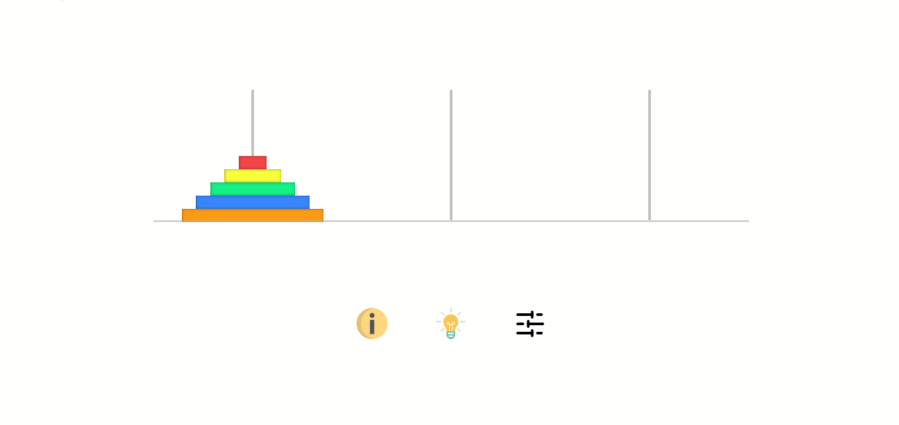

# Tower of Hanoi

Solve a tower of Hanoi with `n` bloc using recursive algorithm. 

## Installation

You only need browser and just clone the project and open [index.html](./dist/index.html)

## Contributing

Pull requests are welcome. For major changes, please open an issue first to discuss what you would like to change.

Please make sure to update tests as appropriate.

## License

[ISC](./LICENSE.txt)